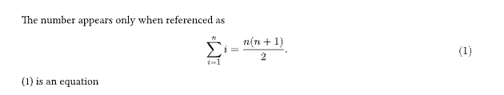
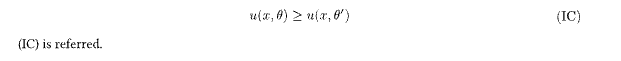
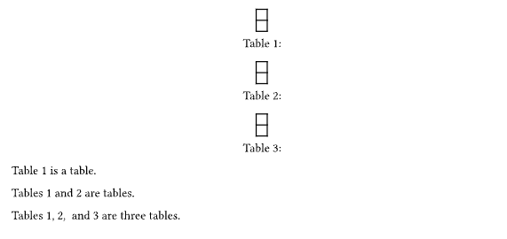

# auto-ref-numbery

A package for numbering equations only when they are referred to.


## Usage
_This is not an official package._


1. Download the package:
   Download and store the folder in {data-dir}/typst/packages/local
   
   {data-dir} is
    * $XDG_DATA_HOME or ~/.local/share on Linux
    * ~/Library/Application Support on macOS
    * %APPDATA% on Windows
1. Import the package
   ```typst
   #import "@local/auto-ref-numbery-main:0.0.1": *
   ```
1. Apply the reference rule: 
    ```typst
    #show ref: it => eq_refstyle(it)
    ```

## Functions

### auto-numbering-equation
The function is named _auto-numbering-equation_, or _aeq_ for short.

#### Example
```
The number appears only when referenced as 
#aeq(<sum>)[
    $
    sum_(i=1)^n i = n(n+1)/2.
    $
    ]

@sum is an equation 
```




#### Parameters
This function requires a label in its first argument. The type of label should be either _str_ or _label_.  
```
aeq(
  [str][label],
  name: [str]
  tag: [bool],
  [content]
) -> [content]
```
##### tag [bool]
Sets a tag instead of equation number. 

Default: false

##### name [str]
Specifies the name of the tag. If none is provided, the tag's name will be the first argument.

Default: none

example: 
```typst
#aeq(<ic>,name:"IC")[
$
u(x,theta)>= u(x,theta') 
$
]
@ic is referred. 
```



##### body [content]

The content of equation.

### eq_refstyle
This function modifies the ref function to work with auto-numbering equations.


### refs
This function is used to reference multiple labels.


#### example
```typst
#figure(caption:"")[#table([],[])]<b>
#figure(caption:"")[#table([],[])]<c>
#figure(caption:"")[#table([],[])]<d>

@b is a table. 

#refs(<b>,<c>) are tables.

#refs(<b>, <c>, <d>) are three tables.
```


#### parameters
```
refs(
    ..[label],
    dict: [dictionary],
    add: [str],
    comma: [str]
) -> content
```

##### dict
A dictionary for plurals. 

Default: plurals_dic 

`plurals_dic` is a predefined dictionary as follows:

```typst
plurals_dic = ("Proposition": "Propositions", "Theorem":"Theorems",
"Lemma":"Lemmata", 
"Definition":"Definitions", 
"Table":"Tables", 
"Assumption":"Assumptions", 
"Figure":"Figures", 
"Example": "Examples", 
"Fact":"Facts"
)
```

##### add
Specifies the conjunction name.


Default: "and"

example:
```
#refs(<b>, <c>, <d>, add:"or") are three tables.
```

##### comma
Specifies the separator between items.


Default: ", "


